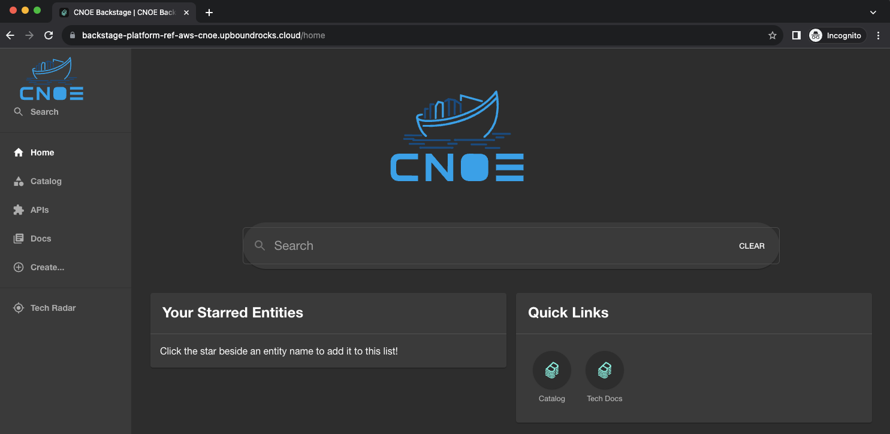
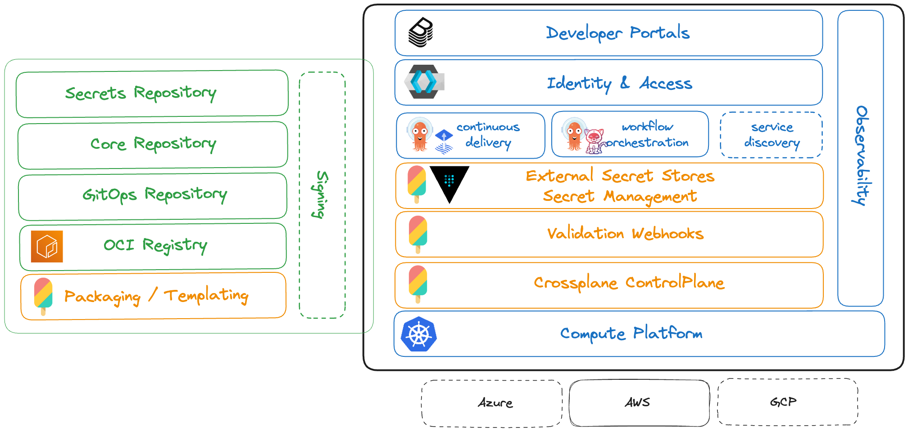

# CNOE Platform Reference on AWS using Crossplane



Every organization has unique requirements for their internal developer platforms (IDPs), making it unreasonable and impractical to design a one-size-fits-all solution.

While there are common practices in using various tools within IDPs, there is a lack of references on configuring and combining these tools effectively to implement desired platform engineering practices.

For more comprehensive information about CNOE and its objectives, visit the [CNOE website](https://cnoe.io/).

## CNOE Platform Overview

In this CNOE platform reference, we leverage AWS and rely on Crossplane as the backbone for our control plane. It's important to note that CNOE is not an effort by AWS alone; rather, it is a collaborative platform that incorporates a variety of technologies and is not limited to any specific cloud provider.

We use Crossplane's packaging features for our APIs and leverage Kubernetes' validation options for the entire stack. While our goal isn't to cover everything, we are committed to gathering community-driven patterns and best practices that reflect common deployments in production.



## Learn More

To explore a more comprehensive understanding of CNOE and its capabilities, refer to the [CNOE website](https://cnoe.io/).

## Reference Implementation

For detailed configurations, patterns, and practices, explore the CNOE reference implementation. The platform encompasses a growing list of technologies to cater to diverse organizational needs.

[Link to the Reference Implementation](https://github.com/cnoe-io/reference-implementation-aws)


  **Capability**              | **Technologies**
------------------------------|---------------------------------
Code Repository               | Git
Config Repository             | Git
Artifact Registry             | Container Registries
Secret Repository             | External Secrets (with Vault and KMS)
Validations                   | Crossplane Validation Webhooks
Secret Management             | Crossplane ESS, External Secrets
ControlPlane                  | Crossplane
Continuous Delivery           | Argo CD, Flux
Continuous Integration        | Argo Workflows, Tekton
Identity & Access             | Keycloak
Developer Portals             | Backstage

# Install
## Configuration
**Step 1: Create the YAML File**

Create a file named `platform-ref-aws-cnoe.yaml` with the following content:

```yaml
apiVersion: pkg.crossplane.io/v1
kind: Configuration
metadata:
  name: platform-ref-aws-cnoe
spec:
  package: xpkg.upbound.io/upbound/platform-ref-aws-cnoe:v0.2.0
```

**Step 2: Apply the Configuration**

Once you have created the YAML file, run the following command in your terminal to apply the configuration:

```bash
kubectl apply -f platform-ref-aws-cnoe.yaml
```

## Configuration Dependency

You are correct. The YAML file I provided earlier is intended to define a Crossplane Configuration, but it cannot be applied directly with `kubectl`. Instead, it is used to build a Crossplane Configuration Package (XPKG), which is a bundled version of your configuration that can be deployed in a Crossplane environment. Here's how you can do that:

**Step 1: Create the Configuration File**

First, create a file named `crossplane.yaml` with the following content:

```yaml
apiVersion: meta.pkg.crossplane.io/v1
kind: Configuration
metadata:
  name: configuration-scratch
spec:
  crossplane:
    version: ">=v1.14.1-0"
  dependsOn:
    - configuration: xpkg.upbound.io/upbound/platform-ref-aws-cnoe
      version: v0.2.0
```

This file defines your Configuration and its dependencies.

**Step 2: Build and Run the Crossplane Package**

For specific details on building and deploying Crossplane packages, we recommend referring to the [Upbound documentation](https://docs.upbound.io/quickstart/aws-deploy/). It provides comprehensive guides and examples that can help you through the process.

## Domain Management

**Preparing for CNOE Platform Deployment with Route 53**

**Step 1: Ensure You Have a Public Route 53 Zone**
- Before deploying the CNOE platform, you need an existing public Route 53 hosted zone in AWS.
- This hosted zone is where your platform's domain records will be managed.

**Step 2: Provide the Route 53 Zone ID**
- When setting up the CNOE platform, you will need to input the Route 53 zone ID.
- The platform will use this ID to automatically extract the domain name (`<DOMAIN_NAME>`) from your hosted zone.

**If You Don't Have a Public Route 53 Hosted Zone:**
- If you don’t already have a public hosted zone in Route 53, you’ll need to register a domain.
- Make sure to use Route 53 as the DNS service for your new domain.
- It’s recommended to create a dedicated subdomain for the CNOE platform. This helps in organizing and managing DNS records specifically for the platform.

By following these steps, you can ensure that your Route 53 setup is ready for a smooth deployment of the CNOE platform. Remember, having the correct Route 53 hosted zone and providing its ID during the setup are crucial for the platform to correctly configure and extract your domain information.
## URLs

To make the instructions about accessing tools on your CNOE platform clearer and more user-friendly, let's break it down into simple steps. Here's a revised version:

**Accessing Tools on Your CNOE Platform**

Once your CNOE platform is up and running, you can easily access various tools through specific URLs. Don't worry about figuring out the domain name; it's automatically extracted from the `Route53Zone` you provided during the setup process. Here's how to access each tool:

1. **Backstage**: To access Backstage, use the following URL format:
   ```
   backstage.<Your_Domain_Name>
   ```
   Replace `<Your_Domain_Name>` with the domain name extracted from your Route 53 Zone.

2. **Keycloak**: For Keycloak, the URL format is:
   ```
   keycloak.<Your_Domain_Name>
   ```
   Again, replace `<Your_Domain_Name>` with your actual domain name.

3. **Argo CD**: To access Argo CD, follow this URL format:
   ```
   argocd.<Your_Domain_Name>
   ```
   Substitute `<Your_Domain_Name>` with your domain name.

These URLs are tailored based on the domain name associated with your setup. Just replace `<Your_Domain_Name>` with the actual domain name provided during the CNOE platform setup, and you'll be able to access each tool directly through your web browser.
